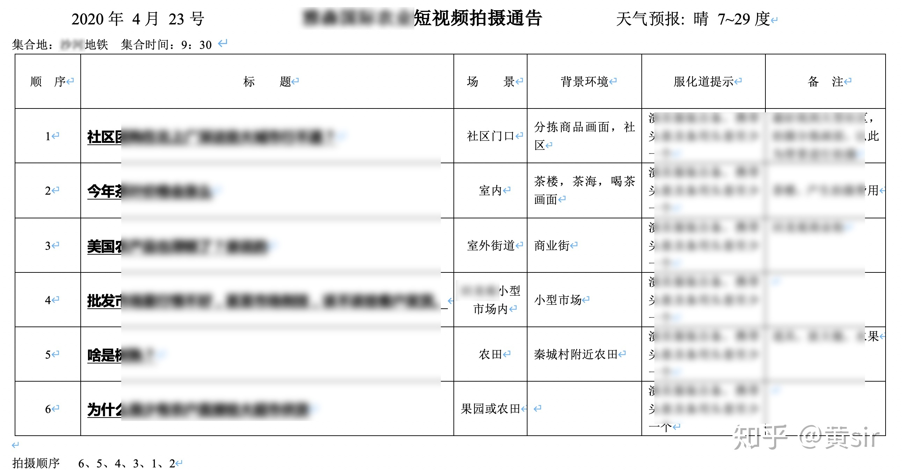
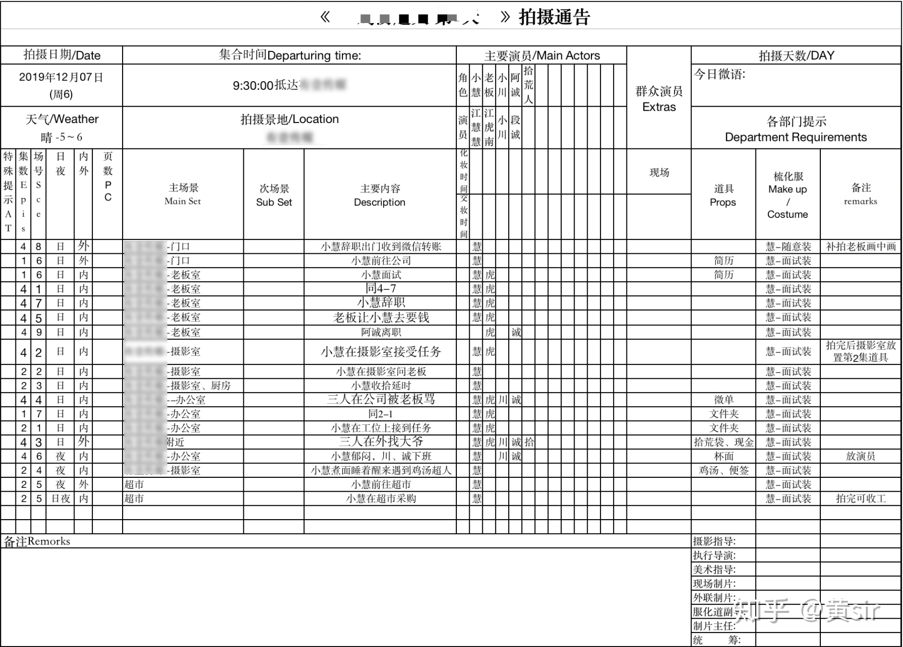
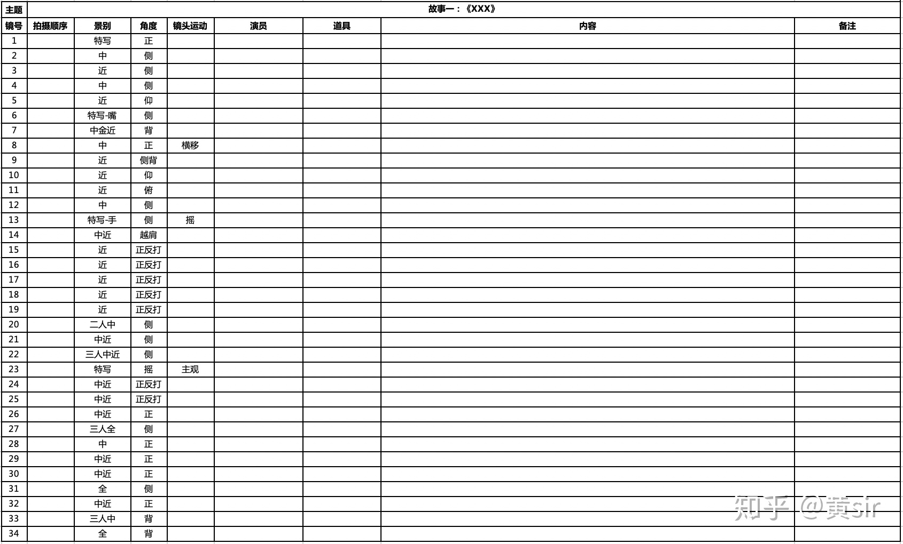
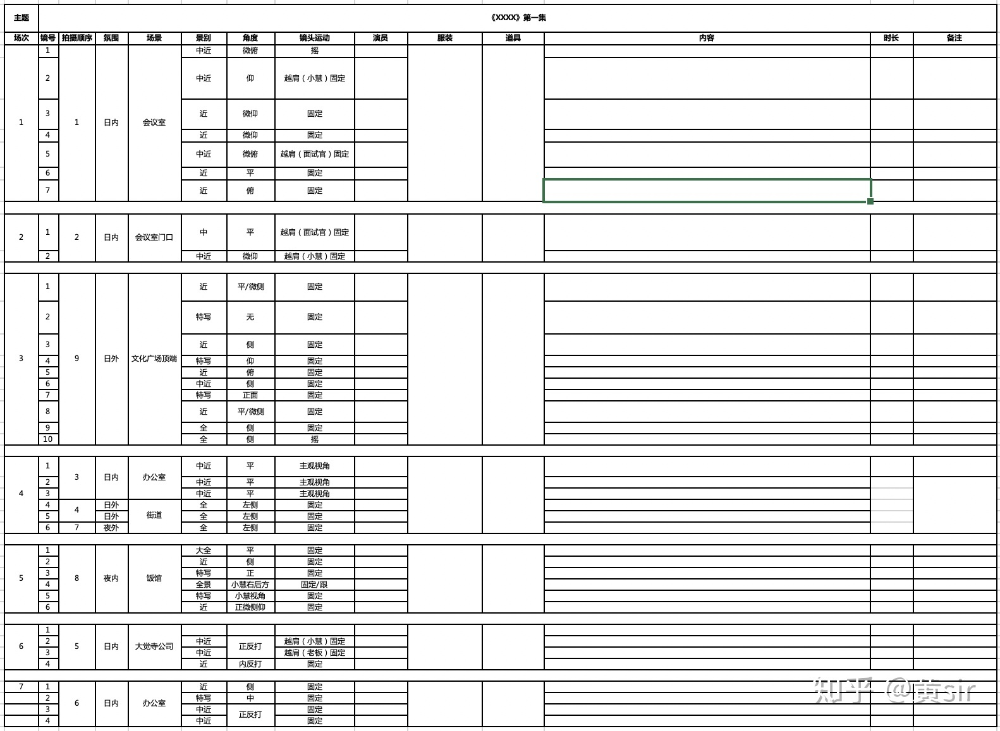

# Vlog

VideoBlog

参考：
 - [Vlog新手创作入门必备教程](https://zhuanlan.zhihu.com/p/268090814)
 - [5000字干货：抖音短视频运营整体策划方案，看完你就学会了](http://www.woshipm.com/operate/4264080.html)
 - [4000字干货—学会短视频分镜头脚本撰写、完整的短视频案例拆解（附脚本模板）](https://zhuanlan.zhihu.com/p/127208419) + [带你全面系统性学习抖音短视频运营](https://www.zhihu.com/column/c_1223194824356483072)
 - [视频脚本怎么写？](http://www.360doc.com/content/20/0802/14/69778623_928130656.shtml)

## 一、前期构思

### 1. 确定主题
 **核心：** 记录自己的生活，分享快乐，传递价值
 
 **类别：** 日常生活（吃、喝、玩、乐；喜、怒、哀、乐）
 
 **具体：** 上下班、工作、学习、生活碎片（eg：日常吃饭、逛街、吵架、等...）、美食、趣味游戏、美妆、才艺、旅拍、故事（一些精彩的、可爱的、或者动情方面的等等），其它（亲情、爱情、友情、节假日、仪式感的”大事件“，小剧情）

### 2. 账号搭建
 - 顶部背景图设计
 - 头像设计
 - 昵称设置
 - 个签签名
 - 其他资料设置等

### 3. 人设
什么是人设？
> 人物设定简称人设，在电影、喜剧、游戏等场景中，会有各类人物设定。明星等公众人物刻意塑造的形象。
> 比如，好男人/国民老公/模范丈夫：文章、陈赫、薛之谦、吴秀波，演员受影视剧角色塑造的影响大。
> 小鲜肉：鹿晗、吴亦凡等

- 形象
- 性格
- 口头禅
- 特点

## 二、拍摄

### 制定拍摄计划表（拍摄通告单）

示例：

### 制定分镜头脚本（拍摄大纲）

**如何写脚本？**

5步骤
 - 1、拟大纲，建框架
 - 2、定主线，有支撑
 - 3、场景设计
 - 4、对时间的把控
 - 5、主题升华

3要素
 - 设置冲突和转折
 - 熟练掌握不同景别和摄法的用处

示例：

