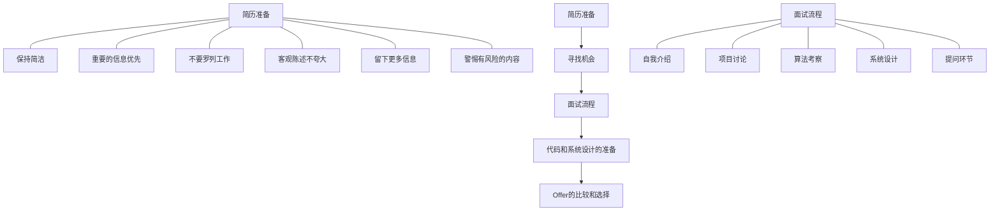
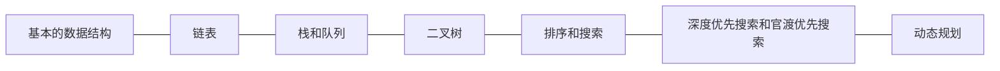

# 魔鬼提升法，进行第6天 - 算法基础

## 2018年9月26日

### 前言

9月20日，写了[《魔鬼提升法》][魔鬼提升法]开篇，定下了目标，记录初心。

现在已进行6天。在此记录下这段时间的总结。以及反省。

#### 1. 进度：
在开篇日记中有说到，我是沿着《iOS面试之道》这本书来进行深入的。

目前6天时间，这本书看到了第91页，第三章。

先来简单说下前两章，也就是我这六天的学习情况。

##### 第一章：iOS 工程师面试



这一章讲述了iOS面试的前中后一套流程。

推荐个[在线MarkDown简历书写工具][ResumeSample]，可直接导出PDF。


##### 第二章：算法基础

这一章，道长从iOS的基本数据结构由浅入深延伸到动态规划。

在此章中，使用Swift实现了链表，栈和队列，二叉树这样的基本数据结构，每小节都会结合实战面试题，来开导思维。与此同时也展现了Swift的语法与技巧。

我在这篇文章的下文，会记录这章的简要内容。内容全部借鉴此章节，其实我记录一半感觉完全没有必要，只是作为一个个人的快速回顾的笔记吧。所以不建议大家看我的记录，关于这章内容，道长在简书中有公布。可直接查看[链接][道长简书链接]。



#### 2. 感悟：

还是经常的后悔前半生，自己算法方便太薄弱了，完全是小白的概念，要学习的东西太多了。相信很多iOS开发者这一块都是自己的薄弱项。

通过这几天的学习，了解了一些基本数据结构、常见排序、搜索，开化逻辑思维。

今后学习书籍：《剑指Offer》

LeetCode： https://leetcode-cn.com

道长的LeetCode-Swift： https://github.com/soapyigu/LeetCode-Swift


---

以下为《iOS面试之道》第二章学习记录

### iOS基本数据结构

数组 字典和集合 字符串 链表 栈和队列 二叉树


##### 用数组实现栈
```swift
class Stack {
    var stack: [AnyObject]
    var isEmpty: Bool { return stack.isEmpty }
    var peek: AnyObject? { return stack.last }

    init() {
        stack = [AnyObject]()
    }

    func push(object: AnyObject) {
        stack.append(object)
    }

    func poop() -> AnyObject? {
        if (stack.isEmpty) {
            return nil
        } else {
            return stack.removeLast()
        }
    }
}
```

##### 给出一个整形数组和一个目标值，判断数组中是否有两个数之和等于目标值

采用**集合**可以优化时间复杂度，即在遍历数组的过程中，用集合每次保存当前值。
```swift
func twoSum(nums: [Int], _ target: Int) -> Bool {
    var set = Set<Int>()

    for num in nums {
        if set.contains(target - num) {
            return true
        }

        set.insert(num)
    }

    return false
}
```

##### 给定一个整形数组中有且仅有两个数之和等于目标值，求这两个数在数组中的序号

为了方便得到序号，这里使用**字典**
```swift
func twoSum(nums: [Int], _ target: Int) -> [Int] {
    var dict = [Int: Int]()

    for (i, num) in nums.enumerated() {
        if let lastIndex = dict[target - num] {
            return [lastIndex, i]
        } else {
            dict[num] = i
        }
    }

    fatalError("No valid output")
}
```

##### 给出一个字符串，要求将其按照单词顺序进行反转

比如，如果是"the sky is blue", 那么反转后的结果就是 "blue is sky the"
```swift
func reverseWords(s: String?) -> String? {
    guard let s = s else {
        return nil
    }

    var chars = Array(s.characters), start = 0
    _reverse(&chars, 0, chars.count - 1)

    for i in 0 ..< chars.count {
        if i == chars.count - 1 || chars[i + 1] == " " {
            _reverse(&chars, start, i)
            start = i + 2
        }
    }

    return String(chars)

}

fileprivate func _reverse<T>(_ chars: inout [T], _ start: Int, _ end: Int) {
    var start = start, end = end

    while start < end {
        _swap(&chars, start, end)
        start += 1
        end -= 1
    }
}

fileprivate func _swap<T>(_ chars: inout [T], _ p: Int, _ q: Int) {
    (chars[p], chars[q]) = (chars[q], chars[p])
}
```

---

### 链表
```swift

// 链表节点
class ListNode {
    var val: Int
    var next: ListNode?

    init(_ val: Int) {
        self.val = val
        self.next = nil
    }
}

// 链表
class List {
    var head: ListNode?
    var tail: ListNode?

    // 尾插法
    func appendTotail(_ val: Int) {
        if tail == nil {
            tail = ListNode(val)
            head = tail
        } else {
            tail!.next = ListNode(val)
            tail = tail!.next
        }
    }

    // 头插法
    func appendToHead(_ val: Int) {
        if head == nil {
            head = ListNode(val)
            tail = head
        } else {
            let temp = ListNode(val)
            temp.next = head
            head = temp
        }
    }
}

class TestSwiftViewController: UIViewController {
    override func viewDidLoad() {
        super.viewDidLoad()

        let list: List = List.init()
        list.appendTotail(1)
        list.appendTotail(5)
        list.appendTotail(3)
        list.appendTotail(2)
        list.appendTotail(4)
        list.appendTotail(2)

        let leftList = partition(list.head, 3)

    }

    // 题目：给出一个链表和一个值x，要求只保留链表中所有小于x的值，原链表的节点顺序不能变
    // 例如：1->5->3->2->4->2，给定x = 3，则返回 1->2->2
    // 思路：采用尾插法，遍历链表，将小于x值得节点接入新的链表即可
    // ***Dummy节点***的作用就是作为一个虚拟的头结点，引入它的原因是我们****不知道要返回的新链表的头节点是哪一个***
    func getLeftList(_ head: ListNode?, _ x: Int) -> ListNode? {
        let dummy = ListNode(0)
        var pre = dummy, node = head

        while node != nil {
            if node!.val < x {
                pre.next = node // pre.next 和 dummy.next 内存地址是一样的
                pre = node!
            }
            node = node!.next
        }

        // 防止构成环
        pre.next = nil

        return dummy.next
    }

    // 题目：给出一个链表和一个x值，要求将链表中所有小于x的值放到左边，所有大于或等于x的值放到右边，并且原链表的节点顺序不能变
    // 例如：1->5->3->2->4->2，给定x = 3，则返回 1->2->2->5->3->4
    // 思路：先处理左边（比x小的节点），然后处理右边（比x大的节点），最后再把左右两边连起来
    func partition(_ head: ListNode?, _ x: Int) -> ListNode? {
        // 引入Dummy节点
        let prevDummy = ListNode(0), postDummy = ListNode(0)
        var prev = prevDummy, post = postDummy
        var node = head

        // 用尾插法处理左边和右边
        while node != nil {
            if node!.val < x {
                prev.next = node
                prev = node!
            } else {
                post.next = node
                post = node!
            }
            node = node!.next
        }

        // 防止构成环
        post.next = nil
        // 左右拼接
        prev.next = postDummy.next

        return prevDummy.next
    }

    // 题目： 反转链表
    func reverseListNode(_ head: ListNode?) -> ListNode? {
        var headNode: ListNode? = head
        var reverseHeadNode: ListNode?
        var preNode: ListNode?


        while headNode != nil {
            let tempNode = headNode?.next // 保留继续循环的节点
            if  tempNode == nil {
                reverseHeadNode = headNode // 最终返回的节点
            }

            headNode?.next = preNode
            preNode = headNode
            headNode = tempNode
        }

        return reverseHeadNode
    }
}
```

### 快行指针
两个指针访问链表，一个在前，一个在后，或者一个移动快，另一个移动慢。

#### 快行指针的实际使用：

##### 1. 检测链表中是否有环
思路：用两个指针同时访问链表，其中一个的速度是另一个的两倍，如果他们变成相等了，那么这个链表就有环了
```swift
func hasCycle(_ head: ListNode?) -> Bool {
        var slow = head
        var fast = head

        while fast != nil && fast!.next != nil {
            slow = slow!.next
            fast = fast!.next!.next

            if slow === fast {
                return true
            }
        }
        return false
    }
```

##### 2.删除链表中倒数第n个节点
例：1->2->3->4->5，n = 2，返回1->2->3->5。

思路：快行指针，移动速度相同，指针一前一后。一开始，第一个指针（在指向头节点之前）就落后第二个指针n个节点。接着二者同时移动，第二个指针移动到尾节点时，第一个节点的下一个节点就是我们要删除的节点。
```swift
func removeNthFromEnd(head: ListNode?, _ n: Int) -> ListNode? {
        guard let head = head else {
            return nil
        }

        let dummy = ListNode(0)
        dummy.next = head
        var prev: ListNode? = dummy
        var post: ListNode? = dummy

        // 设置后一个节点初始位置
        for _ in 0 ..< n {
            if post == nil {
                break
            }
            post = post!.next
        }

        // 同时移动前后节点
        while post != nil && post!.next != nil {
            prev = prev!.next
            post = post!.next
        }

        // 删除节点
        prev!.next = prev!.next!.next

        return dummy.next
    }
```
### 栈和队列

#### 栈

栈是后进先出的结构；

栈的几个基本操作：push, pop, isEmpty, peek, size。

```swift
protocol Stack {
  /// 持有的元素类型
  associatedtype Element

  /// 是否为空
  var isEmpty: Bool { get }
  /// 栈的大小
  var size: Int { get }
  /// 栈顶元素
  var peek: Element? { get }

  /// 进栈
  mutating func push(_ newElement: Element)
  /// 出栈
  mutating func pop() -> Element?
}

struct IntegerStack: Stack {
  typealias Element = Int

  var isEmpty: Bool { return stack.isEmpty }
  var size: Int { return stack.count }
  var peek: Element? { return stack.last }

  private var stack = [Element]()

  func push(_ newElement: Element) {
    stack.append(newElement)
  }

  func pop() -> Element? {
    return stack.popLast()
  }
}
```

#### 队列

队列是先进先出的结构。

于队列的几个操作：enqueue, dequeue, isEmpty, peek, size。

```swift
protocol Queue {
  /// 持有的元素类型
  associatedtype Element

  /// 是否为空
  var isEmpty: Bool { get }
  /// 栈的大小
  var size: Int { get }
  /// 栈顶元素
  var peek: Element? { get }

  /// 入队
  mutating func enqueue(_ newElement: Element)
  /// 出队
  mutating func dequeue() -> Element?
}

struct IntegerQueue: Queue {
  typealias Element = Int

  var isEmpty: Bool { return left.isEmpty && right.isEmpty }
  var size: Int { return left.count + right.count }
  var peek: Element? { return left.isEmpty ? right.first : left.last }

  private var left = [Element]()
  private var right = [Element]()

  mutating func enqueue(_ newElement: Element) {
    right.append(newElement)
  }

  mutating func dequeue() -> Element? {
    if left.isEmpty {
      left = right.reversed()
      right.removeAll()
    }
    return left.popLast()
  }
}
```

#### 栈和队列互转

思路：使用两个栈/队列来解决问题。在原栈/队列的基础上，我们用一个协助栈/队列来帮助我们简化算法，这是一种空间换时间的思路。
```swift
// 用栈来实现队列
struct MyQueue {
  var stackA: Stack
  var stackB: Stack

  var isEmpty: Bool {
    return stackA.isEmpty && stackB.isEmpty;
  }

  var peek: Any? {
    get {
      shift();
      return stackB.peek;
    }
  }

  var size: Int {
    get {
      return stackA.size + stackB.size
    }
  }

  init() {
    stackA = Stack()
    stackB = Stack()
  }

  func enqueue(object: Any) {
    stackA.push(object);
  }

  func dequeue() -> Any? {
    shift()
    return stackB.pop();
  }

  fileprivate func shift() {
    if stackB.isEmpty {
      while !stackA.isEmpty {
        stackB.push(stackA.pop()!);
      }
    }
  }
}

// 用队列实现栈
struct MyStack {
  var queueA: Queue
  var queueB: Queue

  init() {
    queueA = Queue()
    queueB = Queue()
  }

  var isEmpty: Bool {
    return queueA.isEmpty && queueB.isEmpty
  }

  var peek: Any? {
    get {
      shift()
      let peekObj = queueA.peek
      queueB.enqueue(queueA.dequeue()!)
      swap()
      return peekObj
    }
  }

  var size: Int {
    return queueA.size
  }

  func push(object: Any) {
    queueA.enqueue(object)
  }

  func pop() -> Any? {
    shift()
    let popObject = queueA.dequeue()
    swap()
    return popObject
  }

  private func shift() {
    while queueA.size != 1 {
      queueB.enqueue(queueA.dequeue()!)
    }
  }

  private func swap() {
    (queueA, queueB) = (queueB, queueA)
  }
}
```

### 二叉树
二叉树中每个节点最多有两个子节点，一般称为左子节点和右子节点，并且二叉树的子树有左右之分，其次序不能任意颠倒。

二叉查找树，它是一种特殊的二叉树。它的特点就是左子树中节点的值都小于根节点的值，右子树中节点的值都大于根节点的值。

```swift
public class TreeNode {
  public var val: Int
  public var left: TreeNode?
  public var right: TreeNode?
  public init(_val: Int) {
    self.val = val
  }
}

// 计算树的最大深度
func maxDepth(root: TreeNode?) -> Int {
  guard let root = root else {
    return 0
  }
  return max(maxDepth(root.left), maxDepth(root.right)) + 1
}

// 判断一颗二叉树是否为二叉查找树
func isValidBST(root: TreeNode?) -> Bool {
  return _helper(root, nil, nil)
}

private func _helper(node: TreeNode?, _ min: Int?, _ max: Int?) -> Bool {
  guard let node = node else {
    return true
  }
  // 所有右子节点都必须大于根节点
  if let min = min, node.val <= min {
    return false
  }
  // 所有左子节点都必须小于根节点
  if let max = max, node.val >= max {
    return false
  }

  return _helper(node.left, min, node.val) && _helper(node.right, node.val, max)
}

// 用栈实现的前序遍历
func preorderTraversal(root: TreeNode?) -> [Int] {
  var res = [Int]()
  var stack = [TreeNode]()
  var node = root

  while !stack.isEmpty || node != nil {
    if node != nil {
      res.append(node!.val)
      stack.append(node!)
      node = node!.left
    } else {
      node = stack.removeLast().right
    }
  }

  return res
}

/*
层级遍历？其实层级遍历就是图的广度优先遍历，
而广度优先遍历很自然就会用到队列，
所以我们不妨用队列来帮助实现树的层级遍历：
*/

func levelOrder(root: TreeNode?) -> [[Int]] {
  var res = [[Int]]()
  // 用数组来实现队列
  var queue = [TreeNode]()

  if let root = root {
    queue.append(root)
  }

  while queue.count > 0 {
    var size = queue.count
    var level = [Int]()

    for _ in 0 ..< size {
      let node = queue.removeFirst()

      level.append(node.val)
      if let left = node.left {
        queue.append(left)
      }
      if let right = node.right {
        queue.append(right)
      }
    }
    res.append(level)
  }

  return res
}

```

### 搜索和排序

#### 常用排序
| 名称        | 时间复杂度   |  空间复杂度  | 是否稳定  |
| --------   | -----:  | :----:  | :----: |
| 冒泡排序     | O(n^2) |   O(1)  |是  |
| 插入排序     |  O(n^2) |  O(1)  |是  |
| 选择排序       |   O(n^2)    |  O(1)  | 否 |
| 堆排序       |   O(nlogn)    |  O(1)  | 否 |
| 归并排序       |   O(nlogn)    |  O(1)  | 是 |
| 快速排序       |   O(nlogn)    |  O(1)  | 否 |
| 桶排序       |   O(n)    |  O(k)  | 是 |


##### swift实现快速排序：
```swift
func quicksort(_ array: [Int]) -> [Int] {
    guard array.count > 1 else {
        return array
    }

    let pivot = array[array.count / 2]
    let left = array.filter {$0 < pivot}
    let middle = array.filter {$0 == pivot}
    let right = array.filter {$0 > pivot}

    return quicksort(_:left) + middle + quicksort(_:right)

}
```

##### swift实现归并排序：
```Swift
func mergeSort(array: [Int]) -> [Int] {
  var helper = Array(count: array.count, repeatedValue: 0)
  var array = array
  mergeSort(&array, &helper, 0, array.count - 1)
  return array
}

func mergeSort(inout array: [Int], inout _ helper: [Int], _ low: Int, _ high: Int) {
  guard low < high else {
    return
  }

  let middle = (high - low) / 2 + low
  mergeSort(&array, &helper, low, middle)
  mergeSort(&array, &helper, middle + 1, high)
  merge(&array, &helper, low, middle, high)
}

func merge(inout array: [Int], inout _ helper: [Int], _ low: Int, _ middle: Int, _ high: Int) {
  // copy both halves into a helper array
  for i in low ... high {
    helper[i] = array[i]
  }

  var helperLeft = low
  var helperRight = middle + 1
  var current = low

  // iterate through helper array and copy the right one to original array
  while helperLeft <= middle && helperRight <= high {
    if helper[helperLeft] <= helper[helperRight] {
      array[current] = helper[helperLeft]
      helperLeft += 1
    } else {
      array[current] = helper[helperRight]
      helperRight += 1
    }
    current += 1
  }

  // handle the rest
  guard middle - helperLeft >= 0 else {
    return
  }
  for i in 0 ... middle - helperLeft {
    array[current + i] = helper[helperLeft + i]
  }
}
```

##### 排序实战题

已知有很多会议，如果有这些会议时间有重叠，则将它们合并。
比如有一个会议的时间为3点到5点，另一个会议时间为4点到6点，那么合并之后的会议时间为3点到6点

```Swift
public class MeetingTime {
  public var start: Int
  public var end: Int
  public init(_ start: Int, _ end: Int) {
    self.start = start
    self.end = end
  }
}

func merge(meetingTimes: [MeetingTime]) -> [MeetingTime] {
  // 处理特殊情况
  guard meetingTimes.count > 1 else {
    return meetingTimes
  }

  // 排序  
  var meetingTimes = meetingTimes.sort() {
    if $0.start != $1.start {
      return $0.start < $1.start
    } else {
      return $0.end < $1.end
    }
  }

  // 新建结果数组
  var res = [MeetingTime]()
  res.append(meetingTimes[0])

  // 遍历排序后的原数组，并与结果数组归并     
  for i in 1..<meetingTimes.count {
    let last = res[res.count - 1]
    let current = meetingTimes[i]
    if current.start > last.end {
      res.append(current)
    } else {
      last.end = max(last.end, current.end)
    }
  }

  return res
}
```

##### OC实现冒泡排序、选择排序、插入排序、希尔排序

```Objective-C
#pragma mark - 冒泡排序
- (void)bubbleSort:(NSMutableArray *)mutableArray {
    for (int i = 0; i < mutableArray.count - 1; i ++) {
        for (int j = 0; j < mutableArray.count - 1 - i; j ++) {
            if ([mutableArray[j] intValue] > [mutableArray[j + 1] intValue]) {
                int temp = [mutableArray[j] intValue];
                mutableArray[j] = mutableArray[j + 1];
                mutableArray[j + 1] = [NSString stringWithFormat:@"%d",temp];
            }
        }
    }
}

#pragma mark - 选择排序
- (void)selectSort:(NSMutableArray *)mutableArray {
    for (int i = 0; i < mutableArray.count - 1; i ++) {
        for (int j = i + 1; j < mutableArray.count; j ++) {
            if ([mutableArray[i] intValue] > [mutableArray[j] intValue]) {
                int temp = [mutableArray[i] intValue];
                mutableArray[i] = mutableArray[j];
                mutableArray[j] = [NSString stringWithFormat:@"%d",temp];
            }
        }
    }
}

#pragma mark - 插入排序
- (void)insertSort:(NSMutableArray *)mutableArray {
    for (int i = 1; i < mutableArray.count; i ++ ) {
        NSInteger temp = [mutableArray[i] integerValue];
        int j = i;
        while (j > 0 && temp < [mutableArray[j - 1] integerValue]) {
            [mutableArray replaceObjectAtIndex:j withObject:[NSNumber numberWithInteger:[mutableArray[j - 1] integerValue]]];
            j --;
        }
        [mutableArray replaceObjectAtIndex:j withObject:[NSNumber numberWithInteger:temp]];
    }
}

#pragma mark - 希尔排序
- (void)hillSort:(NSMutableArray *)mutableArray {
    int gap = [mutableArray count] / 2.0;
    while (gap >= 1) {
        for (int i = gap; i < mutableArray.count; i ++) {
            NSInteger temp = [mutableArray[i] integerValue];
            int j = i;
            while (j >= gap && temp < [mutableArray[j - gap] integerValue]) {
                [mutableArray replaceObjectAtIndex:j withObject:[NSNumber numberWithInteger:[mutableArray[j - gap] integerValue]]];
                j -= gap;
            }
            [mutableArray replaceObjectAtIndex:j withObject:[NSNumber numberWithInteger:temp]];
        }
        gap = gap / 2;
    }
}

```

#### 二分搜索
二分搜索，即在有序数组中，查找某一特定元素的搜索。它从中间的元素开始，如果中间的元素是要找的元素，则返回；若中间元素小于要找的元素，则要找的元素一定在大于中间元素的那一部分，那只需搜索那部分即可；反之搜索小于中间元素的部分即可。重复以上步骤，直到找到或确认该元素不存在为止。这样每一次搜索，就能减小一办的搜索范围，所以它的算法复杂度为O(logn)。

Swift 实现二分搜索
```swift
// 假设nums是一个升序数组
func binarySearch(_ nums: [Int], _ target: Int) -> Bool {
  var left = 0, mid = 0, right = nums.count - 1

  while left <= right {
    mid = (right - left) / 2 + left

    if nums[mid] == target {
      return true
    } else if nums[mid] < target {
      left = mid + 1
    } else {
      right = mid - 1
    }
  }

  return false
}
```

递归来实现二分搜索
```Swift
func binarySearch(nums: [Int], target: Int) -> Bool {
  return binarySearch(nums: nums, target: target, left: 0, right: nums.count - 1)
}

func binarySearch(nums: [Int], target: Int, left: Int, right: Int) -> Bool {
  guard left <= right else {
    return false
  }

  let mid = (right - left) / 2 + left

  if nums[mid] == target {
    return true
  } else if nums[mid] < target {
    return binarySearch(nums: nums, target: target, left: mid + 1, right: right)
  } else {
    return binarySearch(nums: nums, target: target, left: left, right: mid - 1)
  }
}
```

OC实现：
```Objective-C
+ (NSInteger)binarySearch:(NSArray *)source target:(NSInteger)target {
    if (source.count == 0) {
        return -1;
    }
    NSInteger start = 0;
    NSInteger end = source.count - 1;
    NSInteger mid = 0;
    while (start + 1 < end) {
        mid = start + (end - start) / 2;
        if ([source[mid] integerValue] == target) { // 相邻就退出
            return mid;
        } else if ([source[mid] integerValue] < target) {
            start = mid;
        } else {
            end = mid;
        }
    }
    if ([source[start] integerValue] == target) {
        return start;
    }
    if ([source[end] integerValue] == target) {
        return end;
    }

    return -1;
}
```

##### 实战演练：第一题：版本崩溃

有一个产品发布了n个版本。它遵循以下规律：假如某个版本崩溃了，后面的所有版本都会崩溃。
举个例子：一个产品假如有5个版本，1，2，3版都是好的，但是第4版崩溃了，那么第5个版本（最新版本）一定也崩溃。第4版则被称为第一个崩溃的版本。
现在已知一个产品有n个版本，而且有一个检测算法 func isBadVersion(version: Int) -> Bool 可以判断一个版本是否崩溃。假设这个产品的最新版本崩溃了，求第一个崩溃的版本。
```Swift
func findFirstBadVersion(version: n) -> Int {
  // 处理特殊情况
  guard n >= 1 else {
    return -1
  }

  var left = 1, right = n, mid = 0

  while left < right {
    mid = (right - left) / 2 + left
    if isBadVersion(mid) {
      right = mid
    } else {
      left = mid + 1
    }
  }

  return left    // return right 同样正确
}
```

##### 第二题：搜索旋转有序数组
一个有序数组可能在某个位置被旋转。给定一个目标值，查找并返回这个元素在数组中的位置，如果不存在，返回-1。假设数组中没有重复值。
举个例子：[0, 1, 2, 4, 5, 6, 7]在4这个数字位置上被旋转后变为[4, 5, 6, 7, 0, 1, 2]。搜索4返回0。搜索8则返回-1。

思路：部分进行二分搜索
```Swift
func search(nums: [Int], target: Int) -> Int {
  var (left, mid, right) = (0, 0, nums.count - 1)

  while left <= right {
    mid = (right - left) / 2 + left

    if nums[mid] == target {
      return mid
    }

    if nums[mid] >= nums[left] {
      if nums[mid] > target && target >= nums[left] {
        right = mid - 1
      } else {
        left = mid + 1
      }
    } else {
      if nums[mid] < target && target <= nums[right] {
        left = mid + 1
      } else {
        right = mid - 1
      }
    }
  }

  return -1
}
```

### 深度（Depth-First-Search，以下简称DFS）和广度优先搜索Breadth-First-Search，以下简称BFS）

DFS的实现用递归，BFS的实现用循环（配合队列）。

#### DFS的Swift实现：
```Swift
func dfs(_ root: Node?) {
    guard let root = root else {
        return
    }

    visit(root)
    root.visited = true

    for node in root.neighbors {
        if !node.visited {
            dfs(node)
        }
    }

}
```

#### BFS的Swift实现：
```Swift
func bfs(_ root: Node?) {
    var queue = [Node]()

    if let root = root {
        queue.append(root)
    }

    while !queue.isEmpty {
        let current = queue.removeFirst()

        visit(current)
        current.visited = true

        for node in current.neighbors {
            if !node.visited {
                queue.append(node)
            }
        }
    }
}
```

### 动态规划

其面对的问题通常是无法一蹴而就，需要把复杂的问题分解成简单具体的小问题，然后通过求解简单问题，去推出复杂问题的最终解。

#### 实战题
斐波拉契数列是这样一个数列：1, 1, 2, 3, 5, 8, ... 除了第一个和第二个数字为1以外，其他数字都为之前两个数字之和。现在要求第100个数字是多少。

动态规划有以下几个专有名词：

1. 初始状态，即此问题的最简单子问题的解。在斐波拉契数列里，最简单的问题是，一开始给定的第一个数和第二个数是几？自然我们可以得出是1

2. 状态转移方程，即第n个问题的解和之前的 n - m 个问题解的关系。在这道题目里，我们已经有了状态转移方程F(n) = F(n - 1) + F(n - 2)

解题：
```swift
var nums = Array(repeating: 0, count: 100)

func Fib(_ n: Int) -> Int {
  // 定义初始状态
  guard n > 0 else {
    return 0
  }
  if n == 1 || n == 2 {
    return 1
  }
  // 如果已经计算过，直接调用，无需重复计算
  if nums[n - 1] != 0 {
    return nums[n - 1]
  }

  // 将计算后的值存入数组
  nums[n - 1] = Fib(n - 1) + Fib(n - 2)

  return nums[n - 1]
}
```

动态转移虽然看上去十分高大上，但是它也存在两个致命缺点：

- 栈溢出：每一次递归，程序都会将当前的计算压入栈中。随着递归深度的加深，栈的高度也越来越高，直到超过计算机分配给当前进程的内存容量，程序就会崩溃。
- 数据溢出：因为动态规划是一种由简至繁的过程，其中积蓄的数据很有可能超过系统当前数据类型的最大值，导致崩溃。

对付栈溢出，我们可以把递归写成循环的形式（所有的递归都可改写成循环）；对付数据溢出，我们可以在程序每次计算中，加入数据溢出的检测，适时终止计算，抛出异常。


---

对于这章内容，有部分比较难的实践题没有记录。


[魔鬼提升法]: https://github.com/HaiTeng-Wang/Book/blob/master/魔鬼训练日记/魔鬼提升法.md
[ResumeSample]:https://github.com/geekcompany/ResumeSample
[道长简书链接]: https://www.jianshu.com/u/8d5b91490ca5
